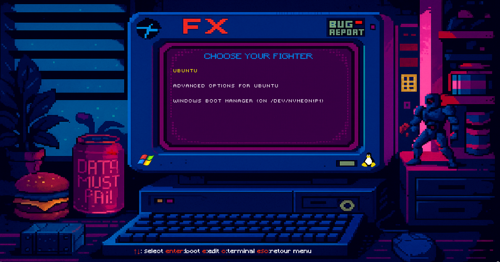

# 🕹️ RetroPunk — GRUB2 Theme

A minimal **retro pixel-style GRUB theme** with a custom PF2 font and a clean centered boot menu.  
Inspired by 80’s CRT vibes and terminal aesthetics.



---

## ✨ Features
- Pixel-art background with neon accents  
- Crisp custom PF2 font (`Victor’s Pixel Font Regular 24`)  
- Centered menu with yellow selection highlight  
- Lightweight and fully GPL-compatible  

---

## 📦 Installation

```bash
git clone https://github.com/simontrost/RetroPunk.git
cd RetroPunk-Theme
sudo ./install.sh
